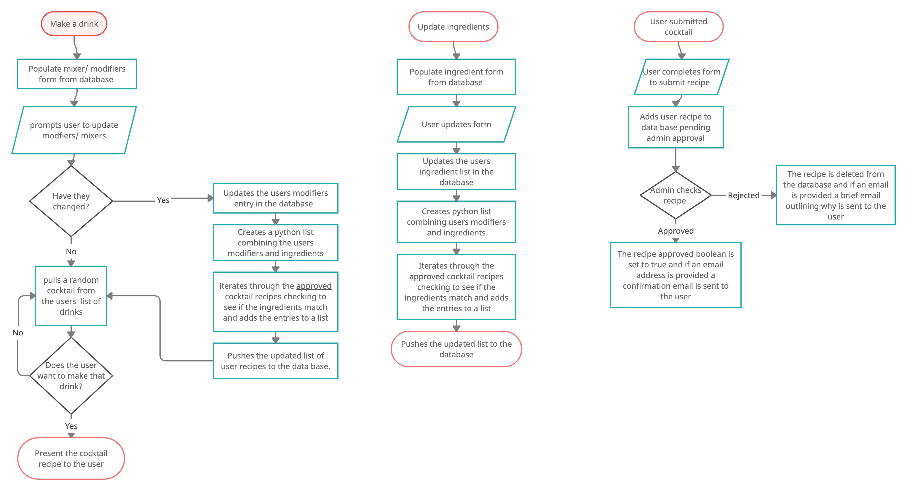
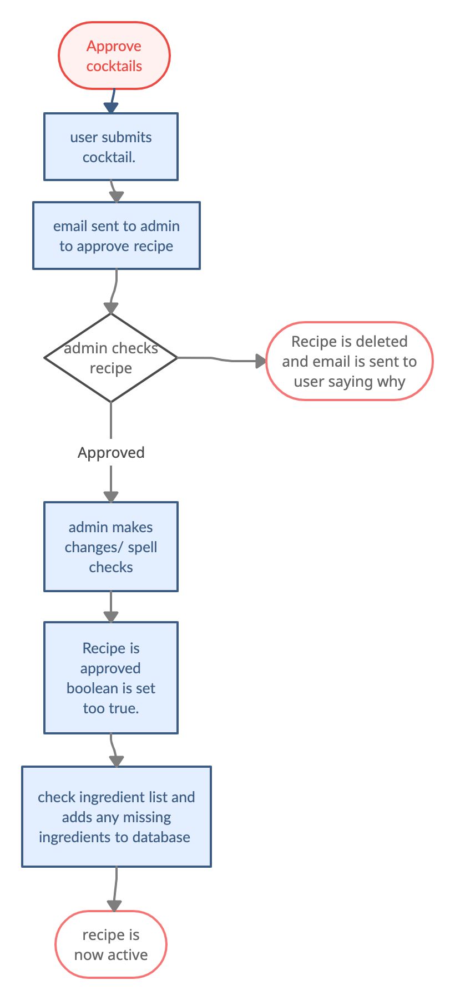
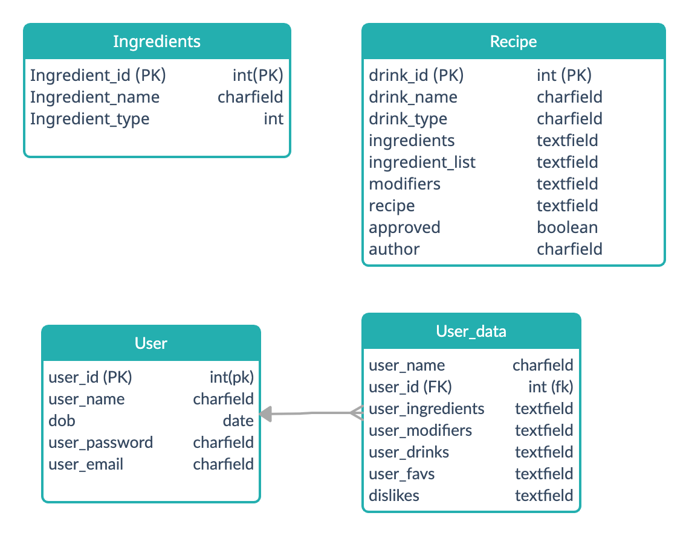

# **MixR - a application for beginner mixologists**

This project is the forth milestone project for the Code Institute Diploma in Full Stack Software Development. 
You can see the final deployed site [here.](site)

The application is designed to help beginer mixologists create cocktails based on ingredients they already have. 

<!--  -->

* [UX](#ux)
    * [User Stories](#user-stories)
    * [Wire Frames](#wire-frames)
    * [Flow Chart](#flowchart)
    * [Database schema](#database-schema)
* [Testing](#testing)
* [Technologies Used](#technologies-used)
    * [Languages](#languages)
    * [Version Control](#version-control)
    * [Packages and frameworks](#packages-and-frameworks)
    * [Other Software](#other-software)
* [Deployment](#deployment)
* [Credits](#credits)
    * [Content](#content)
    * [Acknowledgements](#acknowledgements)

## UX
### User Stories

The app is designed to allow new mixologists to easily make cocktails using ingredients that they already have in stock. I used an agile methodology to devlop the app. The various features were broken up into the following user stories and grouped into epics where applicable. 

#### **Users should be able to create an account so their settings can persist over multiple sessions.** 

* As a user I can create an account so that my ingredient selections are saved between sessions
* As a user I can log out and in so that my account is secure
* As a user I can delete my account so that if I am no longer using the service I don't have any information stored on the app
* As a user I can add an email address to my account so that I can recover my account if I forget my password
* As a user I can change my account details so that I can increase security

#### **Users should be able to get cocktail recommendations based on what ingredients they have.**

* As a user I can get a randomly generated drink recommendation that I can make with ingredients that I have so that I can use the app to make a drink
* As a user I can reject the recommended drink so that I can have a drink that better suits my tastes
* As a user I can rate drinks so that I not suggested drinks that I didn't like

#### **Users should be able to submit their own cocktail recipies.** 

* As a user I can submit my own recipes so that I can share my knowledge
* As a user I can get email notifications when my recipes are approved/ rejected so that can keep track of my submissions
* As a admin I can approve user submitted cocktails so that I can maintain quality recipes
* As a admin I can automatically update ingredient list when approving user submitted recipes so that reduce data entry time
* As a admin I can get emails letting me know when a recipe is submitted so that I can approve recipes quicker
* As a admin I can modify user submissions so that I can ensure a base level quality for all recipes

#### **Users should be able to easily update their ingredients.**

* As a user I can select which ingredients I have so that I am only suggested drinks that I can make

### Wire frames

I used Adobe UX to prototype the websites UX. I took a mobile first approach to the development as due to the (hopefully) social aspect of cocktail making I anticipate most users would be using the app through their mobile phone. 

Here is a [link](https://xd.adobe.com/view/bd1eac7b-6ea7-4898-aef5-78bbcce64842-e84d/?fullscreen) to the working prototype mobile version and to the desktop version [link](https://xd.adobe.com/view/71cbb1d2-a3c2-43d0-a581-7bcd2a058295-2498/).

### Flow Chart

To help understand the logic required when designing the apps processes I built out the following flow charts;

#### User Processes

 

#### Admin Processes

 

### Database Schema

To help sketch out what data would be needed and how best to store it I created the following diagram; 

 

## Technologies Used

[Link to External testing document](./TESTING.md)

## Technologies Used

### Languages

* HTML5 - was the markup language used for the body of the site. 
* CSS3 - was used to style the site's html. 
* JavaScript - was used to provide interactivity to the site's html. 
* Python3 - was used to create the backend. 

### Version Control

* Github - All version control was handled through Github. 

### Database

* Postgres - the project makes use of a postgres database to store all required data. 

### Packages and frameworks
* Django - the backend was built using the django framework. 
* Bootstrap4 - the site relies on the bootstrap libariy to quickly write and style html. 

### Other Software
* [Adobe XD](https://www.adobe.com/uk/products/xd.html) - was used to create the prototype wireframes and to help get the design of the site. 
* [Creately](https://creately.com) - was used to create the database schema and to create flowcharts for the various processes. 
* [coolors](https://coolors.co/) - the colour scheme for the site was generated using coolers.co

### Fonts 
* [Adobe fonts](https://fonts.adobe.com) - I used [Forma DJR](https://fonts.adobe.com/fonts/forma-djr-text) and [Corporate A](https://fonts.adobe.com/fonts/corporate-a) font families from adobe fonts. They were licensed as part of my adobe creative cloud subscription. 
* [Font Awesome](https://fontawesome.com/) - all icons were taken from Fontawesome. 

## Deployment

The app is deplpoyed via [Heroku](https://www.heroku.com/). If you have cloned the repo follow the steps below to deploy your own version. 

1. Go to the [Heroku website](https://heroku.com/) and log in to your account. If you have not made one yet first create an account.

2. On the home page click the new button and then click create new app. 

3. On the next page enter a name for the app. This has to be unnique. You cannot use the same name as I have. Then enter your location before clicking create app. 

4. Click on the resources tab and then add-ons. Use the search bar to locate Heroku Postgres database and add it to the application. 

5. Go to the setting tab and click reveal config vars. Copy the URL value for the DATABASE_URL. 

6. In your IDE create a env.py file on the top level directory. In this file import os and set the following enviroment variables os.environ["DATABASE_URL"] and os.environ["SECRET_KEY"]. Paste your DATABASE_URL from Heroku into the database url and create a random secret key for the other vairable. 

7. Go back to the settings tab in Heroku and add the secret key to the Config Vars using SECRET_KEY as the vairable name. 

8. Click on the Deploy tab on Heroku and scroll down to the deployment method. Select Github. Locatate the mixr cocktail app directory and link it to the heroku. 

9. Select main branch in the manual deployment section and click deploy branch. 

## **Credits**

### **Content**

Any code that is not included as part of a framework or libary was was written by me with the following exceptions;

* The code to reset the style for select buttons was taken from [modern css](https://moderncss.dev/custom-select-styles-with-pure-css/)
* The code to style default placeholder text was taken from [w3schools](https://www.w3schools.com/howto/howto_css_placeholder.asp)

### **Acknowledgements** 

* My mentor [Antonija Simic](https://github.com/tonkec) for their feedback and support during the development of the project. 
* [Code Institute](https://codeinstitute.net/) for giving me the skills through their tutorials to create this app. 
<!-- * [W3Schools](https://www.w3schools.com/) for helping me whenever I got stuck. -->

