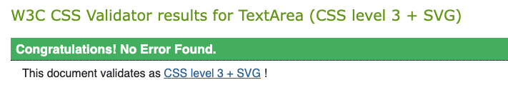
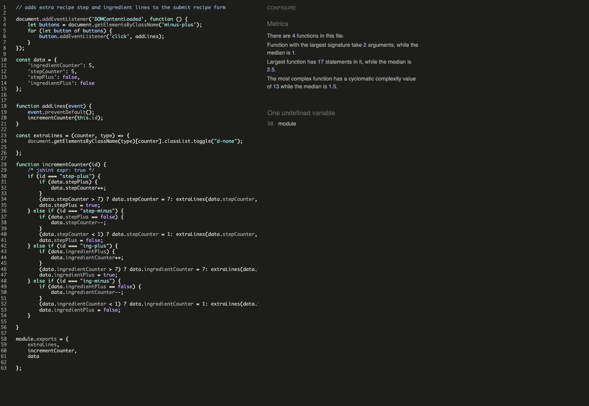

# **Testing** 

* [Functionality Testing](#functionality-testing)
    * [User Story Evaluations](#user-story-valuations)
* [Automated Testing](#automated-testing)
* [Bug Fixes](#bug-fixes)
* [Known Bugs](#known-bugs)
* [Code Validation](#code-validation)

## Functionality Testing

### User Story Evaluations

As part of my functional testing I reviewed my intial user stories. Because I was working in an agile manner some features did not see full development for this release.

I have also included a brief summary of how each user story was implemented or why I chose not to add the feature in this release. 

#### **Users should be able to create an account so their settings can persist over multiple sessions.** 
* As a user I can create an account so that my ingredient selections are saved between sessions

    __*I used allauth to create a robust account management system and I linked this to a user data model allowing the user data to persist inbetween sessions*__

* As a user I can log out and in so that my account is secure

    __*I used all auth's built in templates to create a logout page that is easily accesiable from all pages*__

* As a user I can delete my account so that if I am no longer using the service I don't have any information stored on the app
    
    __*I have yet to implement a delete account function as it was not nesesary for the app to function. This is a feature that will potentially be developed later*__

* As a user I can add an email address to my account so that I can recover my account if I forget my password

    __*There is a password reset feature included in the allauth libary.*__

* As a user I can change my account details so that I can increase security

    __*Users can change some of their account details but I haven't implemented the functionality to completly change all details yet as it made more sense to focus more on core app functionalty.*__

#### **Users should be able to get cocktail recommendations based on what ingredients they have.**

* As a user I can get a randomly generated drink recommendation that I can make with ingredients that I have so that I can use the app to make a drink

    __*The app will only recommend drinks if the user has all the ingredients.*__
* As a user I can reject the recommended drink so that I can have a drink that better suits my tastes

    __*The app prompts users to reject or accept a drink when generating a recipe.*__

* As a user I can rate drinks so that I not suggested drinks that I didn't like

    __*Users can add a recipe to a disliked list. Though at the moment the app doesn't filter out the drinks the user has disliked. In future I would like to add a disliked filter but at the moment it falls outside of core app functionality.*__

#### **Users should be able to submit their own cocktail recipies.** 

* As a user I can submit my own recipes so that I can share my knowledge

    __*There is a user submitted cocktail form easily accesable from the main page.*__

* As a user I can get email notifications when my recipes are approved/ rejected so that can keep track of my submissions

    __*Implementing an email system became too difficult to implement in the timeframe I had and did not impact on the core functionality of the app.*__
* As a admin I can approve user submitted cocktails so that I can maintain quality recipes    

    __*Admins have access to the approval page from their accounts page where they can quickly approve recipes without having to go to the admin page.*__

* As a admin I can automatically update ingredient list when approving user submitted recipes so that reduce data entry time

    __*When approving user generated cocktails any ingredients are automatically added to the correct database.*__
* As a admin I can get emails letting me know when a recipe is submitted so that I can approve recipes quicker

    __*Implementing an email system became too difficult to implement in the timeframe I had and did not impact on the core functionality of the app.*__

* As a admin I can modify user submissions so that I can ensure a base level quality for all recipes

    __*An admin approval system was implemented but at the moment it only allows minor changes to recipes. More detailed changes are able to be implemented from the admin panel. As this only impacted on the site admin and did not negaitivly impact on the user expeiance it was deemed low priorty.*__

#### **Users should be able to easily update their ingredients.**

* As a user I can select which ingredients I have so that I am only suggested drinks that I can make

    __*Users can update modifiers and ingredients. Whenever a new recipe is called for the app checks the users ingredients/ modifiers and cross references it with the recipes to only offer drinks the user can make.*__

## Automated Testing

I created a series of Jest test suites to ensure that my javascript files worked as expected. 

I also created unitest test suites for the dob_check functions and the new_recipe functions.

All test files are included in the repo. 

 **Note;** when running the unitest tests the database needs to be changed in the project_drinkr settings. 

To set up the database for testing you have to comment out the working database and add back in the test database. This will allow you to run the unit tests. 

Once the tests have been run you will need to reverse any changes you made to the setting files. 

I have included some images showing how the settings should look when testing or in production 

#### **Production;**

 

#### **Testing;**

 

You will need to make sure that the changes are reverted when you are finished running any unitest tests. 

## Bug Fixes

During testing I discovered and fixed the following bugs; 

1. If the user entered a long name when submitting a cocktail it would break the layout in the form submit page. This was resolved by adding overflow scroll to any container that used user data. This was fixed in commit [1ae27a](https://github.com/John-McPherson/Full-Stack-Tool-Kit-Portfolio-Project/commit/1ea27a71a760ff6ccf722771c8a274d74681d150)

2. I did not include a max length in the user submitted cocktail form allowing users to submit data that would break the form. This was fixed by adding a max length to the title submission. This was resolved in commit [2b6393](https://github.com/John-McPherson/Full-Stack-Tool-Kit-Portfolio-Project/commit/2b63932f1638f68134fea2aa2196ccdd50c9b147)

3. As users liked more drinks due to the way that they data was handled extra spaces would be added to the begining of the drinks. this would cause the app to crash as it attempeted to load data that did not exist. This was resolved by using the likes_list function to prep the data. This was fixed in commit [7d10fc](https://github.com/John-McPherson/Full-Stack-Tool-Kit-Portfolio-Project/commit/7d10fc4f4d3afe188c7b4e6437a7394c2ec30e0c)

4. When a user liked a drink it would reload the page but wouldn't load the drink ingredients and steps. This was fixed by duplicating the view's get function render in the post function render. This was fixed in commit [64f57b](https://github.com/John-McPherson/Full-Stack-Tool-Kit-Portfolio-Project/commit/64f57b6caade2468e308d04dc046f28a08a88a09)

5. When the user loaded the favs page before they had liked any drinks it would cause the app to crash because there was no data to load. This was fixed by adding a "no recipe" entry to user_likes when creating a new user. This was fixed in commit [b45a7b](https://github.com/John-McPherson/Full-Stack-Tool-Kit-Portfolio-Project/commit/b45a7bb8ac8a2d063cbc2573a23c821144255487)

6. The date of birth function would cause an issue when using data from the database as it would be passed to it as a string. Added a line to the function to convert the string into a useable date object. This was fixed in commit [3aea8b](https://github.com/John-McPherson/Full-Stack-Tool-Kit-Portfolio-Project/commit/3aea8bf3987fb8814e5fd7f06147b327cdb2a588)

7. When approving cocktails all ingredients were being added as a base. Fixed in commit [41d671](https://github.com/John-McPherson/Full-Stack-Tool-Kit-Portfolio-Project/commit/41d671fe770b7c152121830e1ff0547bdacdea26)

8. When approving cocktails the ingredient list would display incorrectly after approving a drink. This was fixed by adding a if statment to check the new ingredients and redirecting the user to account management page to give the database time to update. This was fixed in [ed3e95](https://github.com/John-McPherson/Full-Stack-Tool-Kit-Portfolio-Project/commit/ed3e95df870e961bdf660f71e6baab24101b97cc)

9. When updating a recipe the database would not update. This was resolved by updating the view with the correct data. It was fixed in commits [51173c](https://github.com/John-McPherson/Full-Stack-Tool-Kit-Portfolio-Project/commit/51173c60b1100b2a1c3bab723f61828a324f6dc1) and [0a4549](https://github.com/John-McPherson/Full-Stack-Tool-Kit-Portfolio-Project/commit/0a4549894d9ae8d412b7a756fdfee66efb3205b2)

10. Fix issue when user cause when the user likes their first drink it would add an empty array. This was fixed by adding a if statment to check if the users likes are empty and overwriting the data rather than appending it to an array. This was fixed in commit [bd42ed](https://github.com/John-McPherson/Full-Stack-Tool-Kit-Portfolio-Project/commit/bd42ede8d3a98014d12292c57bc8dd6acd892e00) 

11. The code to generate a random drink would crash if the user didn't have the ingredients to make a drink. This was resolved by checking to see if data exists. This was fixed in commits [90e8be](https://github.com/John-McPherson/Full-Stack-Tool-Kit-Portfolio-Project/commit/90e8be0e5f2314b2b9f78e0290d3a1979c718aca) and [1a899e](https://github.com/John-McPherson/Full-Stack-Tool-Kit-Portfolio-Project/commit/1a899e476e851522a6e20adac7af4ca146cc6c3f)

12. When loading the user modifiers the users data wouldn't persist. This was due to a error where the ingredient data was incorrectly used when rendering the modifier template. This was fixed in commit [d3019c](https://github.com/John-McPherson/Full-Stack-Tool-Kit-Portfolio-Project/commit/d3019c463b8d2bf8b6f8bb6ae944fd3507102edc)

13. If commas are added to when users are submitting a steps it causes the steps to be broken up irratically in the approve cocktail page. This was fixed in commit[bc1c70](https://github.com/John-McPherson/Full-Stack-Tool-Kit-Portfolio-Project/commit/bc1c70a76f720d5f190da78e5c51ee2bf8aad11e)

## Known Bugs

There are currently no known bugs. 

## **Code Validation**

Finally I ran the code through various third party validatiors to ensure that my code is compliant. 

I then ran the code through the [W3C CSS validation](https://jigsaw.w3.org/css-validator/) service and it passed.

 

I also ran my JavaScript files through [jshint.com](https://jshint.com/) and it didn't through up any errors. 

 